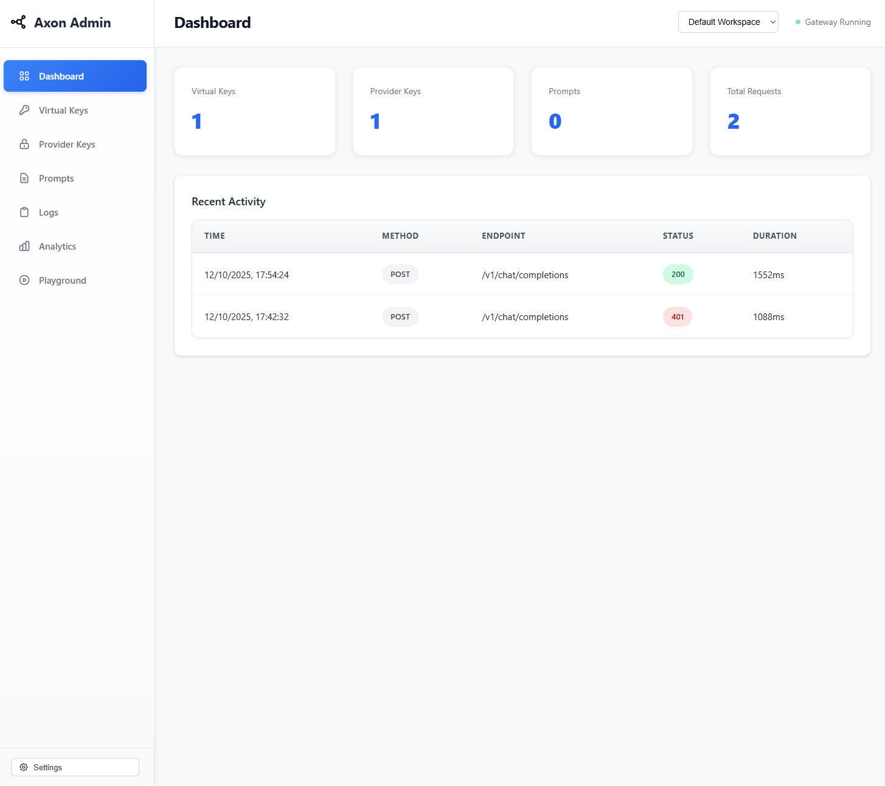
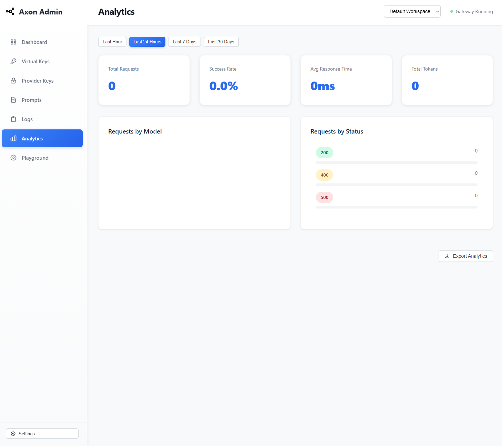
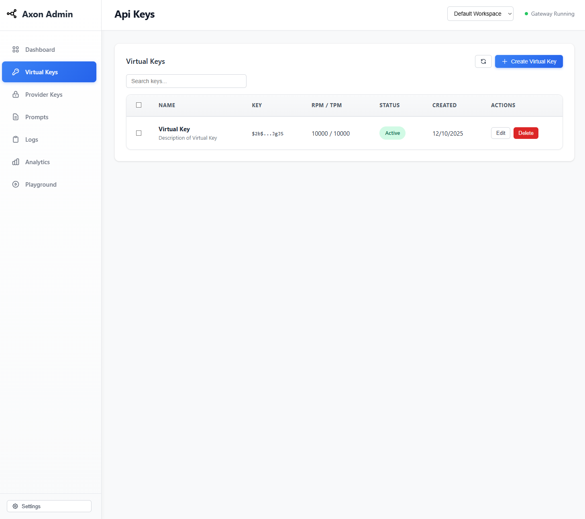
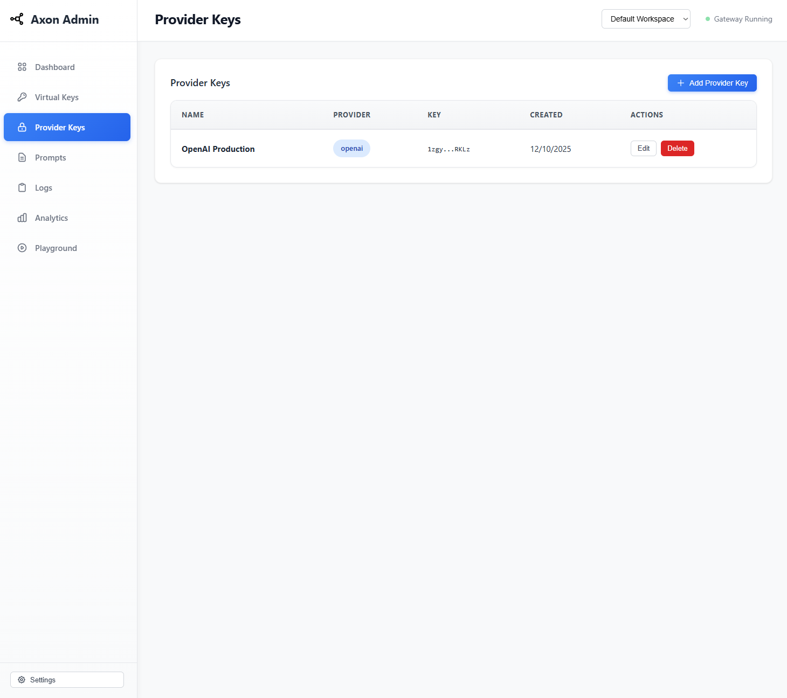
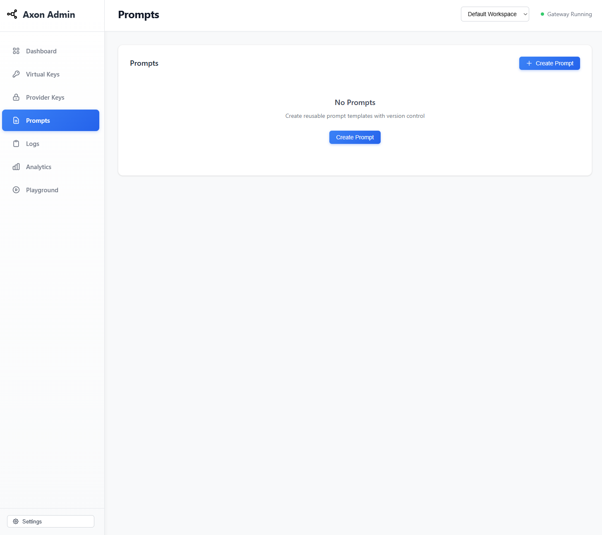
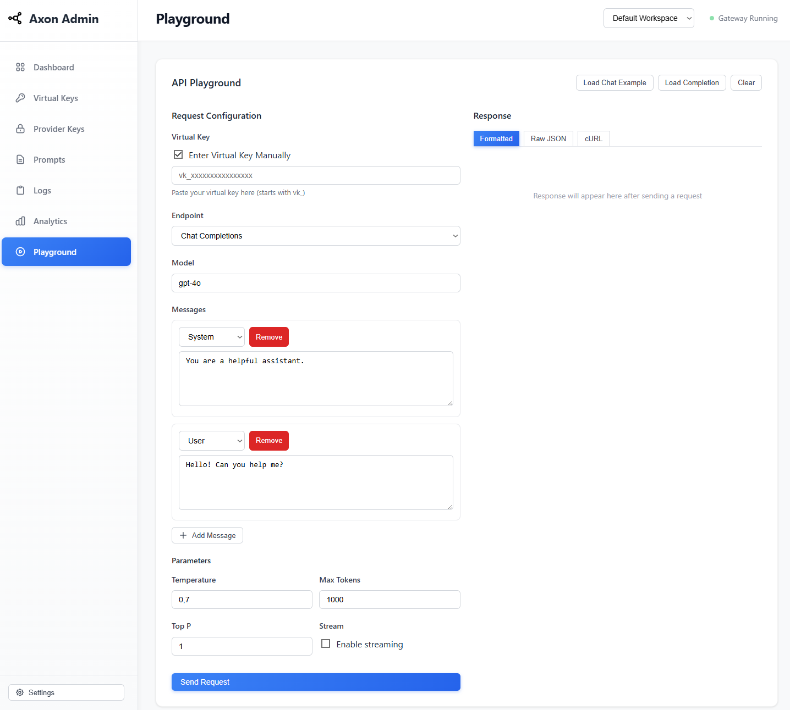
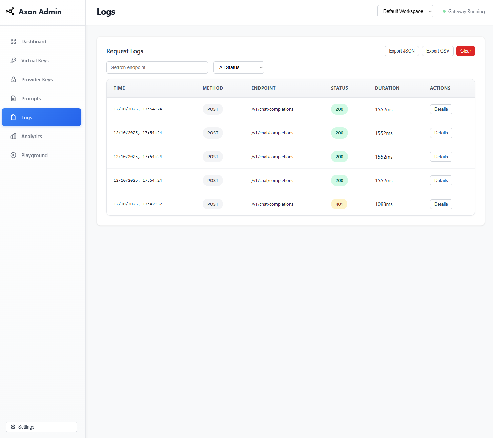

<div align="center">

# Axon AI Gateway
#### Route to 250+ LLMs with 1 fast & friendly API


[Docs](https://axon.wiki/gh-1) | [Enterprise](https://axon.wiki/gh-2) | [Hosted Gateway](https://axon.wiki/gh-3) | [Changelog](https://axon.wiki/gh-4) | [API Reference](https://axon.wiki/gh-5)


[](./LICENSE)
[](https://axon.wiki/gh-6)
[](https://axon.wiki/gh-7)
[](https://axon.wiki/gh-8)
[](https://axon.wiki/gh-9)

<a href="https://us-east-1.console.aws.amazon.com/cloudformation/home?region=us-east-1#/stacks/quickcreate?stackName=axon-gateway&templateURL=https://axon-gateway-ec2-quicklaunch.s3.us-east-1.amazonaws.com/axon-gateway-ec2-quicklaunch.template.yaml"></a> [](https://deepwiki.com/axon-ai/gateway)
</div>

<br/>

The [**AI Gateway**](https://axon.wiki/gh-10) is designed for fast, reliable & secure routing to 1600+ language, vision, audio, and image models. It is a lightweight, open-source, and enterprise-ready solution that allows you to integrate with any language model in under 2 minutes.

- [x] **Blazing fast** (<1ms latency) with a tiny footprint (122kb)
- [x] **Battle tested**, with over 10B tokens processed everyday
- [x] **Enterprise-ready** with enhanced security, scale, and custom deployments

<br>

#### What can you do with the AI Gateway?
- Integrate with any LLM in under 2 minutes - [Quickstart](#quickstart-2-mins)
- Prevent downtimes through **[automatic retries](https://axon.wiki/gh-11)** and **[fallbacks](https://axon.wiki/gh-12)**
- Scale AI apps with **[load balancing](https://axon.wiki/gh-13)** and **[conditional routing](https://axon.wiki/gh-14)**
- Protect your AI deployments with **[guardrails](https://axon.wiki/gh-15)**
- Go beyond text with **[multi-modal capabilities](https://axon.wiki/gh-16)**
- Finally, explore **[agentic workflow](https://axon.wiki/gh-17)** integrations

<br><br>

> [!TIP]
> Starring this repo helps more developers discover the AI Gateway
>
> 
<br>


<br>

## Quickstart (2 mins)

### 1. Setup your AI Gateway

#### Option A: Quick Start (NPX)
```bash
# Run the gateway locally (needs Node.js and npm)
npx @lumenlabs-dev/axon-ai-gateway
```

#### Option B: Full Setup with Database & Admin Panel

**Install dependencies:**
```bash
git clone https://github.com/axon-ai/gateway.git
cd gateway
npm install
```

**Setup database:**
```bash
# Generate new database
npm run db:generate
```

**Run migrations:**
```bash
# Run migrations if needed
npm run db:migrate
```

**Bootstrap database:**
```bash
# Creates initial workspace, admin key, and virtual key
npm run db:bootstrap
```

**Important**: Save both keys from the output:
- **Admin Key** (`ak_*`) - For accessing the admin panel
- **Virtual Key** (`vk_*`) - For gateway API requests with rate limits

**Start the server:**
```bash
npm run dev:node
```

> Gateway API: `http://localhost:8787/v1`
> Admin Panel: `http://localhost:8787/public/`

<details>
<summary><b>🔑 Understanding Keys</b></summary>

The gateway uses two types of keys:

- **Admin Keys** (`ak_*`): Authenticate to the admin panel for managing workspaces, users, and settings
  - Header: `x-axon-admin-key`
  - No rate limits
  - Global access

- **Virtual Keys** (`vk_*`): Gateway access with cost controls
  - Header: `x-axon-api-key`  
  - Rate limits (RPM/TPM)
  - Model restrictions
  - Workspace-scoped

</details>

<sup>
Deployment guides:
&nbsp; <a href="https://axon.wiki/gh-18"> Axon Cloud (Recommended)</a>
&nbsp; <a href="./docs/installation-deployments.md#docker"> Docker</a>
&nbsp; <a href="./docs/installation-deployments.md#nodejs-server"> Node.js</a>
&nbsp; <a href="./docs/installation-deployments.md#cloudflare-workers"> Cloudflare</a>
&nbsp; <a href="./docs/installation-deployments.md#replit"> Replit</a>
&nbsp; <a href="./docs/installation-deployments.md"> Others...</a>

</sup>

### 2. Add Provider Keys

First, add your AI provider keys to the gateway:

```bash
# Add OpenAI key
curl -X POST http://localhost:8787/v1/admin/provider-keys \
  -H "x-axon-admin-key: YOUR_ADMIN_KEY" \
  -H "Content-Type: application/json" \
  -d '{
    "name": "openai-main",
    "provider": "openai",
    "apiKey": "sk-..."
  }'
```

### 3. Make your first request

Use your **Virtual Key** to make gateway requests:

```python
# pip install -qU axon-ai

from axon_ai import Axon

# Configure with your virtual key
client = Axon(
    api_key="YOUR_VIRTUAL_KEY",  # vk_* from bootstrap
    provider="openai"
)

# Make a request through your AI Gateway
client.chat.completions.create(
    messages=[{"role": "user", "content": "What's the weather like?"}],
    model="gpt-4o-mini"
)
```

Or using curl:

```bash
curl http://localhost:8787/v1/chat/completions \
  -H "x-axon-api-key: YOUR_VIRTUAL_KEY" \
  -H "Content-Type: application/json" \
  -d '{
    "model": "gpt-4o-mini",
    "messages": [{"role": "user", "content": "Hello!"}]
  }'
```


<sup>Supported Libraries:
&nbsp; [ JS](https://axon.wiki/gh-19)
&nbsp; [ Python](https://axon.wiki/gh-20)
&nbsp; [ REST](https://axon.sh/gh-84)
&nbsp; [ OpenAI SDKs](https://axon.wiki/gh-21)
&nbsp; [ Langchain](https://axon.wiki/gh-22)
&nbsp; [LlamaIndex](https://axon.wiki/gh-23)
&nbsp; [Autogen](https://axon.wiki/gh-24)
&nbsp; [CrewAI](https://axon.wiki/gh-25)
&nbsp; [More..](https://axon.wiki/gh-26)
</sup>

**Access the Admin Panel:**

Visit `http://localhost:8787/public/` and use your **Admin Key** to:
- View real-time logs and analytics
- Manage virtual keys with rate limits
- Configure provider keys
- Create prompt templates
- Set up guardrails
- Test requests in the playground

<div align="center">
<table>
<tr>
<td width="50%">

<p align="center"><em>Dashboard - Monitor usage and performance</em></p>
</td>
<td width="50%">

<p align="center"><em>Analytics - Track costs and requests</em></p>
</td>
</tr>
<tr>
<td width="50%">

<p align="center"><em>Virtual Keys - Manage rate limits</em></p>
</td>
<td width="50%">

<p align="center"><em>Provider Keys - Secure key storage</em></p>
</td>
</tr>
<tr>
<td width="50%">

<p align="center"><em>Prompts - Template management</em></p>
</td>
<td width="50%">

<p align="center"><em>Playground - Test API requests</em></p>
</td>
</tr>
<tr>
<td colspan="2">

<p align="center"><em>Logs - Real-time request monitoring</em></p>
</td>
</tr>
</table>
</div>

### 4. Advanced Features

#### Cost Control with Virtual Keys

Create virtual keys with rate limits to control costs:

```bash
curl -X POST http://localhost:8787/v1/admin/virtual-keys \
  -H "x-axon-admin-key: YOUR_ADMIN_KEY" \
  -H "Content-Type: application/json" \
  -d '{
    "name": "Production Key",
    "workspaceId": "YOUR_WORKSPACE_ID",
    "rateLimitRpm": 100,
    "rateLimitTpm": 50000,
    "allowedModels": ["gpt-4", "gpt-3.5-turbo"]
  }'
```


### 5. Routing & Guardrails
`Configs` in the LLM gateway allow you to create routing rules, add reliability and setup guardrails.
```python
config = {
  "retry": {"attempts": 5},

  "output_guardrails": [{
    "default.contains": {"operator": "none", "words": ["Apple"]},
    "deny": True
  }]
}

# Attach the config to the client
client = client.with_options(config=config)

client.chat.completions.create(
    model="gpt-4o-mini",
    messages=[{"role": "user", "content": "Reply randomly with Apple or Bat"}]
)

# This would always response with "Bat" as the guardrail denies all replies containing "Apple". The retry config would retry 5 times before giving up.
```
<div align="center">
</div>

You can do a lot more stuff with configs in your AI gateway. [Jump to examples  →](https://axon.wiki/gh-27)

<br/>

## Documentation

- [API Reference (Swagger)](./swagger.yaml) - Complete OpenAPI/Swagger specification
- [Database Setup Guide](./docs/DATABASE_SETUP.md) - Complete guide for workspaces, keys, and rate limits
- [Environment Setup](./docs/ENVIRONMENT_SETUP.md) - Configuration and security best practices
- [Installation & Deployments](./docs/installation-deployments.md) - Deploy to Docker, Kubernetes, cloud platforms

<br/>

### Enterprise Version (Private deployments)

The LLM Gateway's [enterprise version](https://axon.wiki/gh-86) offers advanced capabilities for **org management**, **governance**, **security** and [more](https://axon.wiki/gh-87) out of the box. [View Feature Comparison →](https://axon.wiki/gh-32)

The enterprise deployment architecture for supported platforms is available here - [**Enterprise Private Cloud Deployments**](https://axon.wiki/gh-33)

<hr>


## Core Features
### Reliable Routing
- <a href="https://axon.wiki/gh-37">**Fallbacks**</a>: Fallback to another provider or model on failed requests using the LLM gateway. You can specify the errors on which to trigger the fallback. Improves reliability of your application.
- <a href="https://axon.wiki/gh-38">**Automatic Retries**</a>: Automatically retry failed requests up to 5 times. An exponential backoff strategy spaces out retry attempts to prevent network overload.
- <a href="https://axon.wiki/gh-39">**Load Balancing**</a>: Distribute LLM requests across multiple API keys or AI providers with weights to ensure high availability and optimal performance.
- <a href="https://axon.wiki/gh-40">**Request Timeouts**</a>: Manage unruly LLMs & latencies by setting up granular request timeouts, allowing automatic termination of requests that exceed a specified duration.
- <a href="https://axon.wiki/gh-41">**Multi-modal LLM Gateway**</a>: Call vision, audio (text-to-speech & speech-to-text), and image generation models from multiple providers  — all using the familiar OpenAI signature
- <a href="https://axon.wiki/gh-42">**Realtime APIs**</a>: Call realtime APIs launched by OpenAI through the integrate websockets server.

### Security & Accuracy
- <a href="https://axon.wiki/gh-88">**Guardrails**</a>: Verify your LLM inputs and outputs to adhere to your specified checks. Choose from the 40+ pre-built guardrails to ensure compliance with security and accuracy standards. You can <a href="https://axon.wiki/gh-43">bring your own guardrails</a> or choose from our <a href="https://axon.wiki/gh-44">many partners</a>.
- [**Secure Key Management**](https://axon.wiki/gh-45): Use your own keys or generate virtual keys on the fly.
- [**Role-based access control**](https://axon.wiki/gh-46): Granular access control for your users, workspaces and API keys.
- <a href="https://axon.wiki/gh-47">**Compliance & Data Privacy**</a>: The AI gateway is SOC2, HIPAA, GDPR, and CCPA compliant.

### Cost Management
- [**Smart caching**](https://axon.wiki/gh-48): Cache responses from LLMs to reduce costs and improve latency. Supports simple and semantic* caching.
- [**Usage analytics**](https://axon.wiki/gh-49): Monitor and analyze your AI and LLM usage, including request volume, latency, costs and error rates.
- [**Provider optimization***](https://axon.wiki/gh-89): Automatically switch to the most cost-effective provider based on usage patterns and pricing models.

### Collaboration & Workflows
- <a href="https://axon.ai/docs/integrations/agents">**Agents Support**</a>: Seamlessly integrate with popular agent frameworks to build complex AI applications. The gateway seamlessly integrates with [Autogen](https://axon.wiki/gh-50), [CrewAI](https://axon.wiki/gh-51), [LangChain](https://axon.wiki/gh-52), [LlamaIndex](https://axon.wiki/gh-53), [Phidata](https://axon.wiki/gh-54), [Control Flow](https://axon.wiki/gh-55), and even [Custom Agents](https://axon.wiki/gh-56).
- [**Prompt Template Management***](https://axon.wiki/gh-57): Create, manage and version your prompt templates collaboratively through a universal prompt playground.
<br/><br/>

<sup>
*&nbsp;Available in hosted and enterprise versions
</sup>

<br>

## Cookbooks

### Trending
- Use models from [Nvidia NIM](/cookbook/providers/nvidia.ipynb) with AI Gateway
- Monitor [CrewAI Agents](/cookbook/monitoring-agents/CrewAI_with_Telemetry.ipynb) with Axon!
- Comparing [Top 10 LMSYS Models](/cookbook/use-cases/LMSYS%20Series/comparing-top10-LMSYS-models-with-Portkey.ipynb) with AI Gateway.

### Latest
* [Create Synthetic Datasets using Nemotron](/cookbook/use-cases/Nemotron_GPT_Finetuning_Portkey.ipynb)
* [Use the LLM Gateway with Vercel's AI SDK](/cookbook/integrations/vercel-ai.md)
* [Monitor Llama Agents with Axon LLM Gateway](/cookbook/monitoring-agents/Llama_Agents_with_Telemetry.ipynb)

[View all cookbooks →](https://axon.wiki/gh-58)
<br/><br/>

## Supported Providers

Explore Gateway integrations with [45+ providers](https://axon.wiki/gh-59) and [8+ agent frameworks](https://axon.wiki/gh-90).

|                                                                                                                            | Provider                                                                                      | Support | Stream |
| -------------------------------------------------------------------------------------------------------------------------- | --------------------------------------------------------------------------------------------- | ------- | ------ |
|                                                                               | [OpenAI](https://axon.wiki/gh-60)                           | ✅       | ✅      |
|                                                                                  | [Azure OpenAI](https://axon.wiki/gh-61)               | ✅       | ✅      |
|                                                                               | [Anyscale](https://axon.wiki/gh-62) | ✅       | ✅      |
|                            | [Google Gemini](https://axon.wiki/gh-63)             | ✅       | ✅      |
|                                                                              | [Anthropic](https://axon.wiki/gh-64)                     | ✅       | ✅      |
|                                                                                 | [Cohere](https://axon.wiki/gh-65)                           | ✅       | ✅      |
|  | [Together AI](https://axon.wiki/gh-66)                 | ✅       | ✅      |
|                                                                  | [Perplexity](https://axon.wiki/gh-67)                | ✅       | ✅      |
|                                                                | [Mistral](https://axon.wiki/gh-68)                      | ✅       | ✅      |
|                                                               | [Nomic](https://axon.wiki/gh-69)                             | ✅       | ✅      |
|                                               | [AI21](https://axon.wiki/gh-91)                                    | ✅       | ✅      |
|                                                    | [Stability AI](https://axon.wiki/gh-71)               | ✅       | ✅      |
|                                             | [DeepInfra](https://axon.sh/gh-92)                               | ✅       | ✅      |
|                                                                   | [Ollama](https://axon.wiki/gh-72)                           | ✅       | ✅      |
|                                                                          | [Novita AI](https://axon.wiki/gh-73)                              | ✅       | ✅      | `/chat/completions`, `/completions` |


> [View the complete list of 200+ supported models here](https://axon.wiki/gh-74)
<br>

<br>

## Agents
Gateway seamlessly integrates with popular agent frameworks. [Read the documentation here](https://axon.wiki/gh-75).


| Framework | Call 200+ LLMs | Advanced Routing | Caching | Logging & Tracing* | Observability* | Prompt Management* |
|------------------------------|--------|-------------|---------|------|---------------|-------------------|
| [Autogen](https://axon.wiki/gh-93)    | ✅     | ✅          | ✅      | ✅   | ✅            | ✅                |
| [CrewAI](https://axon.wiki/gh-94)             | ✅     | ✅          | ✅      | ✅   | ✅            | ✅                |
| [LangChain](https://axon.wiki/gh-95)             | ✅     | ✅          | ✅      | ✅   | ✅            | ✅                |
| [Phidata](https://axon.wiki/gh-96)             | ✅     | ✅          | ✅      | ✅   | ✅            | ✅                |
| [Llama Index](https://axon.wiki/gh-97)             | ✅     | ✅          | ✅      | ✅   | ✅            | ✅                |
| [Control Flow](https://axon.wiki/gh-98) | ✅     | ✅          | ✅      | ✅   | ✅            | ✅                |
| [Build Your Own Agents](https://axon.wiki/gh-99) | ✅     | ✅          | ✅      | ✅   | ✅            | ✅                |

<br>

*Available on the [hosted app](https://axon.wiki/gh-76). For detailed documentation [click here](https://axon.wiki/gh-100).


## Gateway Enterprise Version
Make your AI app more <ins>reliable</ins> and <ins>forward compatible</ins>, while ensuring complete <ins>data security</ins> and <ins>privacy</ins>.

✅&nbsp; Secure Key Management - for role-based access control and tracking <br>
✅&nbsp; Simple & Semantic Caching - to serve repeat queries faster & save costs <br>
✅&nbsp; Access Control & Inbound Rules - to control which IPs and Geos can connect to your deployments <br>
✅&nbsp; PII Redaction - to automatically remove sensitive data from your requests to prevent indavertent exposure <br>
✅&nbsp; SOC2, ISO, HIPAA, GDPR Compliances - for best security practices <br>
✅&nbsp; Professional Support - along with feature prioritization <br>

[Schedule a call to discuss enterprise deployments](https://axon.sh/demo-13)

<br>


## Contributing

The easiest way to contribute is to pick an issue with the `good first issue` tag 💪. Read the contribution guidelines [here](/.github/CONTRIBUTING.md).

Bug Report? [File here](https://axon.wiki/gh-78) | Feature Request? [File here](https://axon.wiki/gh-78)


### Getting Started with the Community
Join our weekly AI Engineering Hours every Friday (8 AM PT) to:
- Meet other contributors and community members
- Learn advanced Gateway features and implementation patterns
- Share your experiences and get help
- Stay updated with the latest development priorities

[Join the next session →](https://axon.wiki/gh-101) | [Meeting notes](https://axon.wiki/gh-102)

<br>

## Community

Join our growing community around the world, for help, ideas, and discussions on AI.

- View our official [Blog](https://axon.wiki/gh-78)
- Chat with us on [Discord](https://axon.wiki/community)
- Follow us on [Twitter](https://axon.wiki/gh-79)
- Connect with us on [LinkedIn](https://axon.wiki/gh-80)
- Read the documentation in [Japanese](./.github/README.jp.md)
- Visit us on [YouTube](https://axon.wiki/gh-103)
- Join our [Dev community](https://axon.wiki/gh-82)